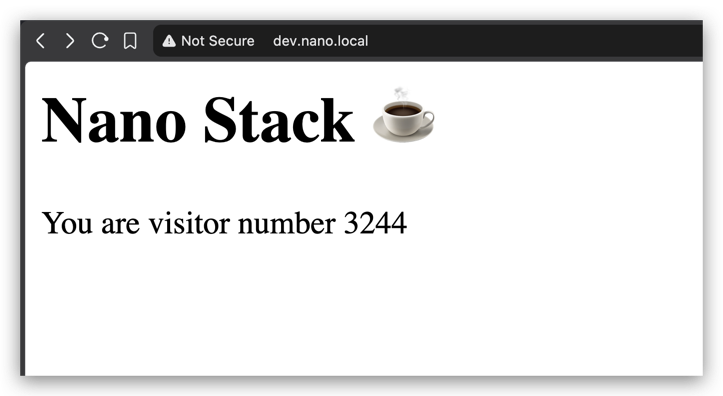

# Nano Stack

A small learning project simulating a 2-person startup building and deploying a simple web app, from plain Docker through a migration to Kubernetes, all running locally.

## The Story

The app started simple, one Flask container, one Postgres container, run by hand with `docker run`. It worked fine for a while, fast to ship, nothing complicated.

As usage grew, cracks showed: no self-healing when something crashed, no isolated environment to test changes safely, passwords typed into plain commands, no clean way to update or roll back. A decision was made to migrate to Kubernetes, securing the setup, adding a proper dev environment, and building toward something that could scale under real traffic.

## Goal

Learn Kubernetes fundamentals through a hands-on, staged project rather than isolated examples. Each stage builds on the last, and the two problems above (why Docker alone wasn't enough, why the database needed a real migration) shape the order the project follows.

## The App

A minimal Flask web app plus a Postgres database. It shows a page and counts visitors, storing the count in the database. The app itself is intentionally simple, the focus is the infrastructure around it.



## Prerequisites

Using Colima with Kubernetes on Mac, lightweight and easy to get running via Homebrew.

```bash
brew install colima
brew install kubectl
colima start --kubernetes
```

Docker Desktop with Minikube can also work as an alternative.

## Tech Stack

- Python (Flask)
- PostgreSQL
- Docker
- Kubernetes, via Colima
- kubectl

## Stages

*(updated as the project goes)*

### Starting up - Docker
We created an environment in Docker because it seemed easy at the moment, simple, fast to ship, not really secured.<br>

[Stage 1 - Prepare the enviroment in Docker](docs/stage-1-enviroment-docker.md)<br>
[Stage 2 - Write app, build and run the web service](docs/stage-2-deploy-app.md)<br>

___

### Growing bigger - lets move to Kubernetes

Our user database is growing, latency spikes and crashes during weekends. We cannot maintain it in Docker anymore.
<br>A decision was made to migrate to Kubernetes and make it secured and scalable to traffic spikes. <br>We also create a DEV
enviroment to test new features in the future.

[Stage 3 - Create "dev" and "prod" Namespaces](docs/stage-3-dev-prod-namespaces.md)
___

We want our database setup secured from the start, no plain-text passwords, storage that survives a crash, and a stable way for the app to find it.

[Stage 4 - Deploy Postgres Pods with Volume, Secret and Service for both Namespaces](docs/stage-4-postges-pvc-secret-pod-service.md)
___

With the database ready, the app itself needs to run the same way, built from the same image, pointed at the right database, and reachable by something other than its own changing IP.

[Stage 5 - Deploy App Pod and Service for "dev" and "prod" Namespaces](docs/stage-5-app-pods-dev-prod.md)
___

The real data still lived in the old Docker setup. Before trusting Kubernetes with production, we needed to move that data over safely, without losing anything, and without real downtime for users.

[Stage 6 - Database migration and cutover](docs/stage-6-migration-cutover.md)
___

### The app runs on Kubernetes now, a few things still need hardening
Clients were given raw port numbers to reach the app, not something we could hand out in a real company. We needed one clean, stable entry point instead.

[Stage 7 - Expose the App with Ingress for "dev" and "prod"](docs/stage-7-ingress.md)
___

Right now, each app runs as exactly one Pod. If that one Pod crashes, or gets overwhelmed by traffic, there's no backup, no second copy to take the load or keep serving while it recovers.

[Stage 8 - Deployment for Scaling and Replicas](docs/stage-8-scaling.md)
___

Each app's settings, database name and user, were typed directly into the Deployment itself, mixed in with how the Pod runs. We wanted plain, non-sensitive config kept separate and reusable, the same way Secrets already separated out the password.

[Stage 9 - ConfigMap, moving plain settings out of the Deployment](docs/stage-9-configmap.md)

___

With self-healing and scaling in place, a Pod could still receive traffic before it was actually ready, or stay running even after getting stuck. We needed Kubernetes to actively check each Pod's health, not just assume a running Pod means a working one.

- [Stage 10 - Health Checks, Liveness and Readiness Probes](docs/stage-10-health-checks.md)

## What's Next

- New app version 2.0, redesigned UI
- Rolling updates and rollbacks
- Resource limits
- Helm, packaging the whole setup as a reusable chart
- Basic CI/CD

## Concepts to Know, Not Built Here

A few real-world Kubernetes topics worth recognizing by name, even without hands-on practice in this project.

- RBAC, controlling who can do what inside a cluster
- NetworkPolicies, firewall-style rules between Pods
- StatefulSets, the proper way to run databases in Kubernetes, used a bare Pod here for simplicity
- Multi-node scheduling, this project runs on a single node, so pod placement across machines never comes into play
