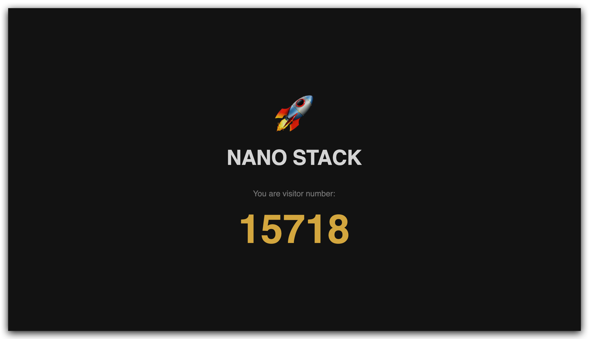
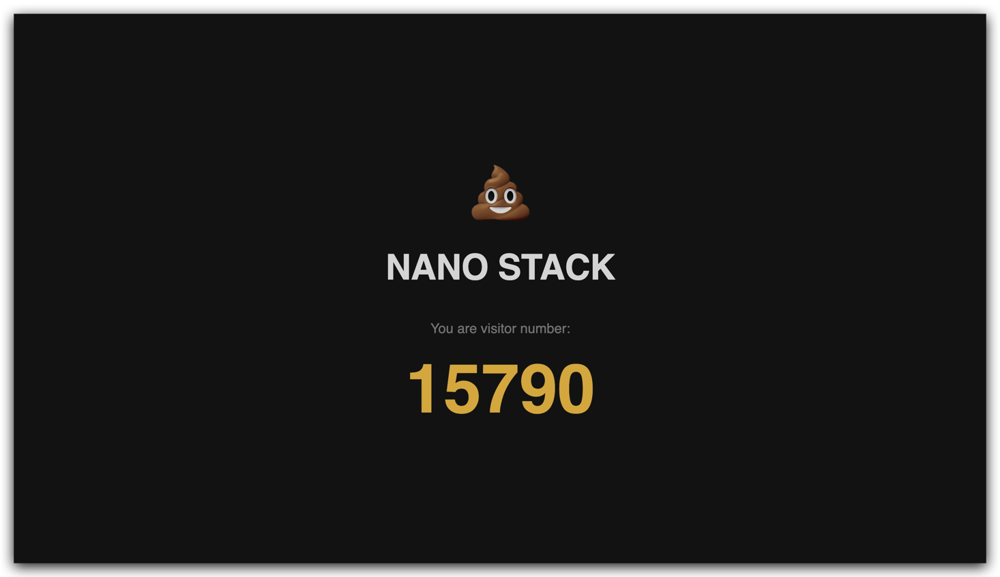
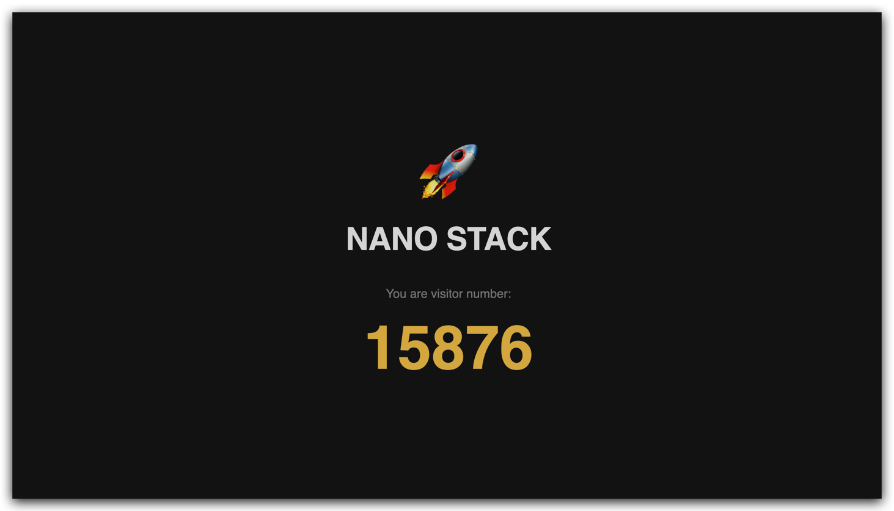

# Stage 11, Rolling updates and rollbacks

Every template change so far, the ConfigMap, the health probes, already triggered a rolling update behind the scenes. This stage puts that on purpose, a real redesign, a real mistake, and a real recovery.

## The redesign

New code came in from the developer side, a visual overhaul for `app.py`, dark theme, a logo, a cleaner layout for the visitor count.

### Build the new version

```bash
docker build -t nano-stack-app:2.0 ./app
```

### Confirm it's visible to the cluster

```bash
colima ssh -- sudo k3s crictl images
```

### Deploy it

Updated the image line in `deployment.yaml`

```yaml
          image: nano-stack-app:2.0
```

```bash
kubectl apply -f dev/app/deployment.yaml -n dev
```

### Watch the rollout

```bash
kubectl get pods -n dev -w
```

New Pods came up running 2.0, passed readiness, only then were the old 1.0 Pods retired, one at a time, no downtime.



## A mistake ships to prod

A few small design iterations followed, each one its own version bump, built and deployed the same way as above. Along the way, version 2.1 accidentally shipped with the wrong logo, and worse, it went straight to prod, same build and deploy steps, just pointed at `prod/app/deployment.yaml -n prod` this time.



## Rolling it back

```bash
kubectl rollout undo deployment/nano-app -n prod
```

```
Warning: resource deployments/nano-app was previously managed with 'kubectl apply'. Rolling back will not update the kubectl.kubernetes.io/last-applied-configuration annotation...
deployment.apps/nano-app rolled back
```

The warning is expected, `rollout undo` restores a previous revision directly, bypassing the tracking `kubectl apply` normally keeps, worth knowing about, not an error.



*Look how the visitor count kept rising the whole time.* 

<br>The rollback happened live, zero downtime, the same rolling mechanism that deployed 2.0 in the first place, just running in reverse.

## Syncing the file back to reality

A `rollout undo` happens outside the YAML file, so after it, the file and the cluster disagree, the file still claims the broken version is running.

```bash
kubectl get deployment nano-app -n prod -o jsonpath='{.spec.template.spec.containers[0].image}'
```

Confirmed the real running image, `2.0`, updated `prod/app/deployment.yaml` to match, keeping the file honest again.

## Rollout history

```bash
kubectl rollout history deployment/nano-app -n prod
```

```
REVISION  CHANGE-CAUSE
1         <none>
2         <none>
3         <none>
7         <none>
8         <none>
```

Every revision was tracked automatically, but `CHANGE-CAUSE` stayed empty, Kubernetes doesn't record why something changed unless told to.

Tried it manually

```bash
nano-stack-k8s % kubectl annotate deployment/nano-app -n prod kubernetes.io/change-cause="Deployed v2.0 redesign" --overwrite

nano-stack-k8s % kubectl rollout history deployment/nano-app -n prod
deployment.apps/nano-app 
REVISION  CHANGE-CAUSE
1         <none>
2         <none>
3         <none>
7         <none>
8         Deployed v2.0 redesign
```

It worked, but typing a long annotation command for every single deploy isn't realistic. In real pipelines, this gets filled in automatically from a commit message, not typed by hand, left proper automated annotations for the CI/CD stage later.

## Concepts learned

A rolling update is triggered just by changing the Pod template, most often the image tag, Kubernetes handles the gradual replacement on its own.
`kubectl rollout undo` restores the previous revision straight from Kubernetes' own history, no rebuilding, no hunting for the old image.
A manual rollback leaves the YAML file out of sync with the cluster, worth checking and fixing afterward.
`rollout history` keeps a log automatically, but it's only readable if `CHANGE-CAUSE` is actually recorded.
A small mistake, one wrong logo, is exactly the kind of everyday incident rollback exists for, not just big catastrophic failures.

